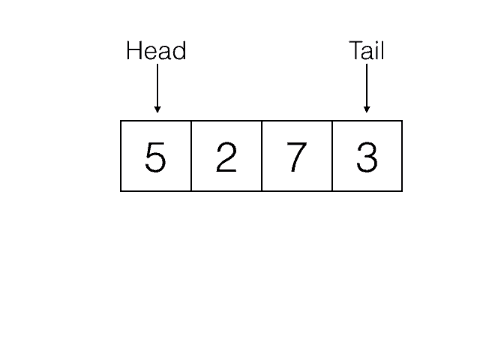
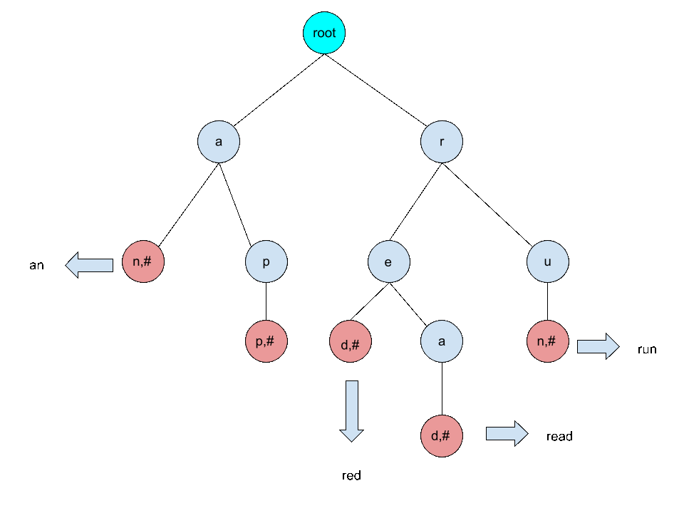
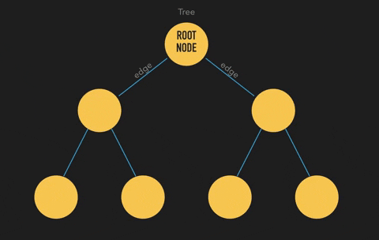
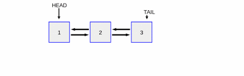

# Data Structure Compendium


This repository features a set of projects that simulate different data structures. Each project focuses on a specific concept in C++.

## 📋 Requirements
- Make
- C++ compiler
- CxxTest (for running tests)

To install the requirements on Debian based systems, use the following commands:

```bash
sudo apt update
sudo apt install build-essential
sudo apt install cmake
sudo apt install cxxtest
```

## 📂 Projects

<div align="center">
1. Stack Simulation: [War](stack/)


2. Queue simulation: [Factory](queue/)



3. Trie implementation: [Dictionnary](trie/)



4. N-ary Tree with Family Tree Simulation: [Family Tree](family_tree/)



5. Linked list global sum: [Distributed list](distributed_list/)



</div>